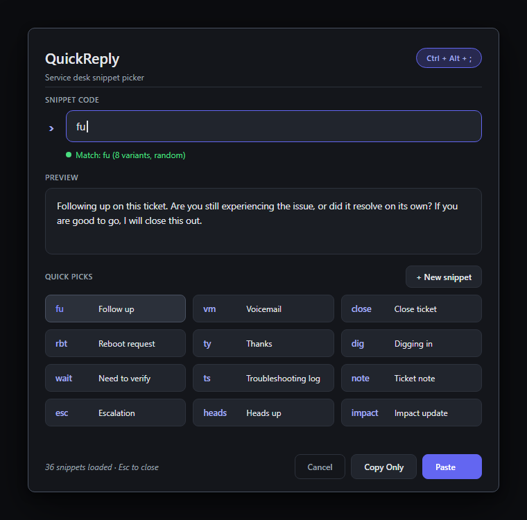
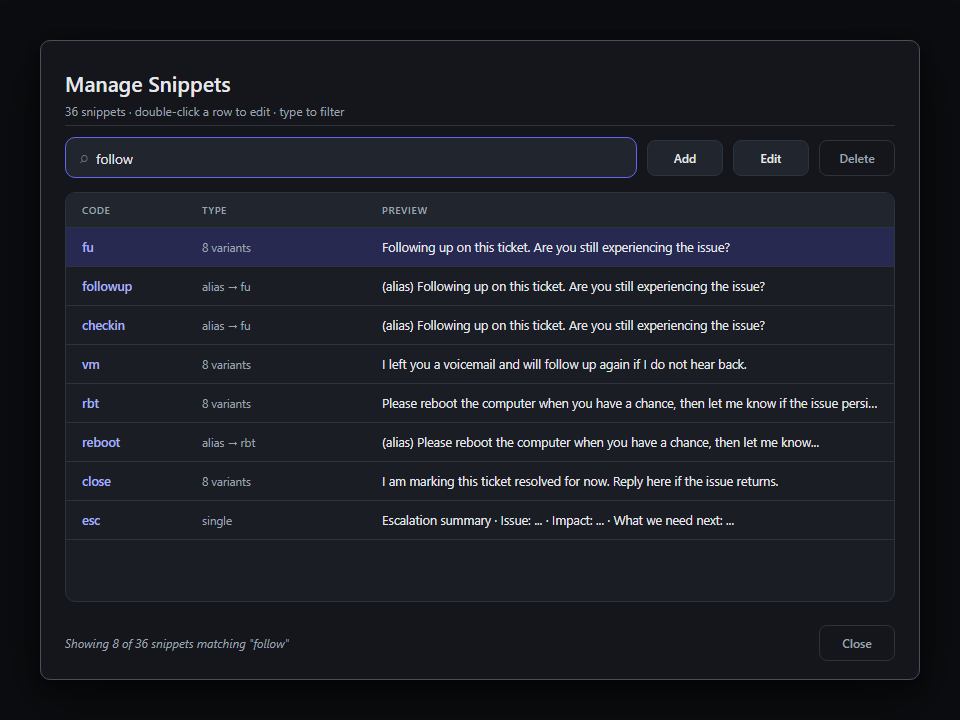
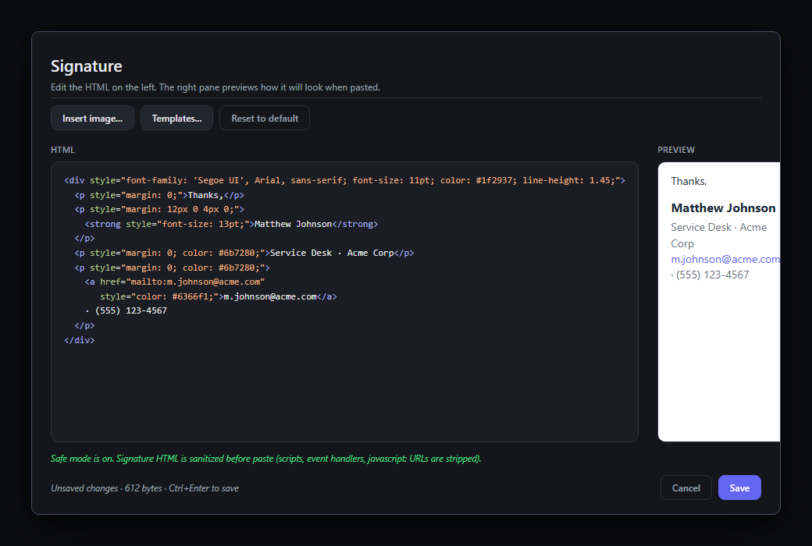

# QuickReply

A small Windows tray utility for service desk and support workflows. Press a hotkey, type a short code like `fu`, and paste a clean, consistent reply into your ticket.

[](https://github.com/Tofu-Water-Drinker/QuickReply/releases/latest)
[](https://github.com/Tofu-Water-Drinker/QuickReply/actions/workflows/build.yml)
[](https://github.com/Tofu-Water-Drinker/QuickReply/releases)
[](LICENSE)


> Latest release: see the [releases page](https://github.com/Tofu-Water-Drinker/QuickReply/releases/latest). Each release ships `QuickReply.exe`, `QuickReplySetup.exe`, and SHA256 sidecar files. The installer verifies the SHA256 of the binary it downloads before launching it. [Grab the installer.](https://github.com/Tofu-Water-Drinker/QuickReply/releases/latest/download/QuickReplySetup.exe)

## Screenshots

The picker:



The Manage Snippets dialog:



The Signature editor with live preview:



## Why QuickReply exists

QuickReply started as a simple AutoHotkey script for common service desk responses. The idea was practical: type short triggers like `;fu`, `;vm`, `;close`, `;rbt` and have them expand into pre-written ticket replies, so techs would not have to retype "Following up on this ticket..." for the hundredth time that week.

AutoHotkey was great for prototyping. The problem is that real ticket systems are not always plain text. Browser-based ticket UIs, rich text editors, and SLA portals do not always play nicely with hotstrings. Fields drop characters, the script stops mid-replacement, paste behavior fights the editor, or the trigger fires inside something like a code block where you do not want it. Clipboard-based replacement helped, but it always felt like duct tape. Dialog-based AHK pickers were better, but rough around the edges and still hit reliability limits in browser ticket UIs.

QuickReply is the standalone version of that idea. It is a native Windows tray app that opens from a global hotkey, shows you the matching reply, and either pastes it directly or hands you a clean copy for manual paste. No hotstrings to misfire. No fragile browser injection. Open, pick, paste.

## Security and privacy

QuickReply is the kind of app people are right to be careful about: it registers a global hotkey, reads and writes the clipboard, sends synthetic Ctrl+V, and can run at startup. So here is exactly what it does and does not do.

**What it does**

* Registers exactly one global hotkey (default `Ctrl+Alt+;`, configurable).
* Reads the clipboard before a paste, and writes back what it found afterward.
* Sends Ctrl+V to the foreground window when AutoPaste is on.
* Pings `api.github.com/repos/Tofu-Water-Drinker/QuickReply/releases/latest` on startup to check for a newer release. This is the only network call. Turn it off in Settings.
* Optionally writes one registry value under `HKCU\Software\Microsoft\Windows\CurrentVersion\Run` so the tray app launches at sign-in.
* Stores `snippets.json`, `appsettings.json`, and `signature.html` under `%APPDATA%\QuickReply` (or next to the EXE in portable mode).

**What it does not do**

* No telemetry. No analytics. No crash reports phoned home.
* No snippet sync. Your replies never leave the machine.
* No automatic self-update. The startup check tells you a release exists, then gets out of the way. You decide when to upgrade.
* No second hotkey, no keyboard logging, no clipboard logging.
* No third-party NuGet packages. The supply-chain surface is `System.*`, `Microsoft.Win32.*`, and Win32 P/Invoke.

**Release verification**

Every release ships:

* `QuickReply.exe` and `QuickReply.exe.sha256`
* `QuickReplySetup.exe` and `QuickReplySetup.exe.sha256`
* `SHA256SUMS.txt` (both hashes in one file, human-readable)

The installer downloads `QuickReply.exe.sha256` from the same release, hashes the EXE on the way to disk, and aborts the install if the hashes do not match. You can verify the installer the same way before running it:

```pwsh
Get-FileHash .\QuickReplySetup.exe -Algorithm SHA256
# Compare to QuickReplySetup.exe.sha256 from the release page.
```

Release artifacts are produced by [`.github/workflows/release.yml`](.github/workflows/release.yml) on a Windows GitHub Actions runner, on tag push. The workflow itself is in this repo and uses no third-party Actions beyond the official `actions/checkout`, `actions/setup-dotnet`, and `softprops/action-gh-release`.

**Signature HTML safe mode**

The signature feature lets you author arbitrary HTML and paste it into your ticket / email tool. Safe mode is on by default and strips `<script>`, `<iframe>`, `<object>`, `<embed>`, event-handler attributes, and `javascript:` URLs before the HTML touches the clipboard. The Signature editor shows a live banner when the sanitizer plans to change something. You can disable safe mode in Settings if you know what you are doing.

**Authenticode signing**

The current binaries are not Authenticode-signed (open-source code-signing certificates are not free or self-service). Windows SmartScreen may show a "publisher: Unknown" warning the first time you run them. If this is a blocker for your environment, build from source. Signing infrastructure is on the roadmap.

## What's new

### v1.4.0

* **Data lives in `%APPDATA%\QuickReply` by default.** `snippets.json`, `appsettings.json`, and `signature.html` no longer have to share a folder with `QuickReply.exe`. The runtime auto-migrates any pre-1.4 files it finds next to the EXE.
* **Portable mode.** Drop a `portable.flag` file next to the EXE (or check the box in the setup wizard) and QuickReply keeps everything in the install folder, USB-stick style.
* **Installer SHA256 verification.** The setup wizard fetches `QuickReply.exe.sha256` from the same release as the binary and refuses to launch a download whose hash does not match.
* **Full clipboard preservation.** "Restore clipboard after paste" now snapshots HTML, RTF, text, images, and file drop lists, not just plain text. Earlier versions silently destroyed everything except text.
* **Snippet validation reporting.** `snippets.json` entries with the wrong shape (null, number, object, bool, empty variants) are now reported in a single grouped warning instead of being silently dropped.
* **Signature safe mode.** HTML signatures pass through a sanitizer (scripts, iframes, event handlers, `javascript:` URLs) before they hit the clipboard. The Signature editor surfaces a banner when the sanitizer plans to change something.
* **GitHub Actions release pipeline.** Releases are built on `windows-latest`, ship deterministic hashes, and include both binaries plus their `.sha256` sidecars.
* **License.** MIT.
* **AGENTS.md.** Contributor and code-agent guide so this repo does not drift on the next round of changes.

### v1.3.0

* **First-launch tutorial** (5 pages, skippable) and an in-app **Settings dialog** so you never need to open `appsettings.json` by hand. Tray menu adds "Settings..." and "Show Tutorial...".

### v1.2.x

* **v1.2.3** Hotkey is now a toggle: press once to open the picker, press again to close.
* **v1.2.2** Inner-control focus restore for ConnectWise Manage and other apps where the outer window regaining foreground does not auto-restore keyboard focus.
* **v1.2.1** Reliable focus restore before paste, via the AttachThreadInput trick and deferred-paste BeginInvoke.
* **v1.2.0** Rich-text signature with HTML editor, live preview, embedded base64 images, three preset templates.

### v1.1.0

* **Reply variants.** Each conversational code ships with up to eight different ways to say the same thing; the picker chooses one at random.
* **Aliases.** Type `rbt`, `reboot`, or `restart` and get the same reply.
* **Manage Snippets dialog.** Filterable list with edit, delete, add.

### v1.0.0

* First public release.

## What you get

Out of the box, QuickReply ships with the kinds of snippets a service desk tech actually uses every day. A few examples:

| Code | What it says, roughly |
| --- | --- |
| `fu` | "Following up on this ticket. Are you still experiencing the issue?" |
| `vm` | "I left you a voicemail and will follow up again if I do not hear back." |
| `close` | "I am marking this ticket resolved for now. Reply here if it returns." |
| `rbt` | "Please reboot the computer when you have a chance, then let me know." |
| `ts` | Multi-line troubleshooting template (performed / result / next step) |
| `esc` | Escalation summary template (issue / impact / what we need next) |
| `vendorcase` | "We opened a case with the vendor and are waiting on their response." |

Edit, add, rename, and reload without restarting the app.

## Features

* Global hotkey snippet picker (default **Ctrl + Alt + ;**, configurable)
* **Paste** and **Copy Only** modes. Copy Only is the always-safe path for picky web apps.
* **Variants per code** with randomization, so replies do not sound copy-pasted
* **Aliases** so you can use any shorthand that sticks in your head
* **Rich-text signature** with HTML editor, live preview, embedded images, three preset templates, and a safe-mode HTML sanitizer
* Dynamic date and time tokens (`{{date:yyyy-MM-dd}}`)
* **Manage Snippets** dialog: see, edit, delete, and add snippets from one list
* **In-app Settings GUI** (no need to edit `appsettings.json` by hand)
* First-launch **tutorial** (skippable, replayable from the tray menu)
* Tray menu, reload without restart, open data folder
* Quiet GitHub update check on startup, on-demand "Check for Updates..."
* **Full clipboard preservation** across HTML, RTF, text, images, file lists
* **Portable mode** (drop `portable.flag` next to the EXE)
* Single executable, zero third-party NuGet packages, no telemetry
* .NET 8, WinForms, Windows 10/11

## How it works

1. Press **Ctrl + Alt + ;** anywhere in Windows.
2. The picker opens centered on your active screen, focused on the code input.
3. Type a code like `fu`, or click one of the quick-pick chips.
4. The matching reply previews live.
5. Press **Enter** (or click **Paste**) to paste it into the window you came from.
6. Or click **Copy Only** to drop the snippet on your clipboard for a manual Ctrl+V.

QuickReply remembers the window and the inner text-box that had focus before opening the picker, restores both before sending Ctrl+V, and (optionally) puts your previous clipboard contents back when it is done.

### When to use Copy Only

AutoPaste is best-effort. It works in most native and web apps, but some browser-based ticket systems, rich-text editors, and SLA portals intercept programmatic paste. They strip the keystroke, double-paste, or drop the input entirely.

**Copy Only sidesteps all of that.** It puts the snippet on your clipboard and gets out of the way. You paste with Ctrl+V yourself; the ticket field sees a normal user paste. If a particular field gives you trouble, Copy Only is the reliable fallback and is recommended for any system that has misbehaved on you before.

## Install

### Option 1: Run the setup wizard (recommended)

Download `QuickReplySetup.exe` from the [latest release](https://github.com/Tofu-Water-Drinker/QuickReply/releases/latest) and double-click it. The wizard walks you through:

1. **Welcome.** What you are installing.
2. **Install location.** Defaults to `%LOCALAPPDATA%\Programs\QuickReply` (no admin needed).
3. **Hotkey.** Keep the default `Ctrl + Alt + ;` or pick your own.
4. **Snippets.** Use the included set, start empty, or define your own in a small grid.
5. **Preferences.** Windows startup, randomized variants, and **portable mode** (keeps all data next to the EXE instead of in `%APPDATA%`).
6. **Summary.** Review your choices.
7. **Install.** Downloads the latest `QuickReply.exe` from this repository's releases, verifies its SHA256 against the release's `.sha256` sidecar, then writes your settings.

### Option 2: Plain download

Grab `QuickReply.exe` directly from the [latest release](https://github.com/Tofu-Water-Drinker/QuickReply/releases/latest), verify its hash against the release's `QuickReply.exe.sha256`, and drop the EXE anywhere. On first launch it creates `snippets.json`, `appsettings.json`, and `signature.html` under `%APPDATA%\QuickReply` with the defaults.

### Option 3: Build from source

Requires the .NET 8 SDK.

```bash
git clone https://github.com/Tofu-Water-Drinker/QuickReply.git
cd QuickReply
dotnet build QuickReply.sln -c Release
dotnet run --project src/QuickReply/QuickReply.csproj -c Release
```

To produce the single-file binaries that ship in a release:

```bash
dotnet publish src/QuickReply/QuickReply.csproj -c Release -r win-x64 \
  --self-contained true -p:PublishSingleFile=true -p:IncludeNativeLibrariesForSelfExtract=true \
  -o publish

dotnet publish src/QuickReplySetup/QuickReplySetup.csproj -c Release -r win-x64 \
  --self-contained true -p:PublishSingleFile=true -p:IncludeNativeLibrariesForSelfExtract=true \
  -o publish-setup
```

## Using the picker

| Action | How |
| --- | --- |
| Open the picker | Press the global hotkey, or double-click the tray icon |
| Close the picker | Press the global hotkey again, press **Esc**, or click outside |
| Set the code | Type it, or click a quick-pick chip |
| Paste into the previous window | Press **Enter** or click **Paste** |
| Copy without auto-pasting | Click **Copy Only** |
| Add a new snippet | Click **+ New snippet**, or use the tray menu |

## Tray menu

Right-click the tray icon for the full menu:

| Item | What it does |
| --- | --- |
| Open QuickReply | Opens the picker (same as the hotkey or double-clicking the tray icon) |
| Manage Snippets... | Opens the filterable snippet list with edit, delete, and add |
| Add Snippet... | Opens the focused single-snippet editor |
| Edit Signature... | Opens the HTML signature editor with live preview |
| Copy Signature | Puts your signature on the clipboard (rich HTML + plain text fallback) |
| Reload Snippets | Re-reads `snippets.json` from disk, no restart needed |
| Open Snippets File | Opens `snippets.json` in your default editor |
| Open Settings File | Opens `appsettings.json` in your default editor |
| Settings... | Opens the in-app Settings dialog (all of `appsettings.json`, plus open-data-folder) |
| Show Tutorial... | Replays the first-launch tutorial |
| Check for Updates... | Hits GitHub and tells you whether there is a newer release |
| Exit | Quits QuickReply and unregisters the global hotkey |

## Where data lives

By default:

* `%APPDATA%\QuickReply\snippets.json`
* `%APPDATA%\QuickReply\appsettings.json`
* `%APPDATA%\QuickReply\signature.html`

This is the right place for a per-user Windows app: it survives reinstalls, works under managed Program Files installs, and roams in domain profiles that have profile roaming enabled.

**Portable mode.** If a file literally named `portable.flag` exists next to `QuickReply.exe`, all three files live next to the EXE instead. This is the USB-stick / single-folder workflow. The setup wizard's Preferences page has a checkbox for this; you can also toggle it manually by adding or removing the flag file and restarting QuickReply.

**Migration.** If you upgrade from v1.3 or earlier and you have data files sitting next to your `QuickReply.exe`, QuickReply will copy them into `%APPDATA%\QuickReply` on first launch. The originals stay where they are; nothing is destroyed.

## Editing snippets

### Manage Snippets dialog

Right-click the tray icon and choose **Manage Snippets...**. You get a filterable list of everything you have, showing the code, the type (single, N variants, or alias), and a preview of the first variant. Double-click a row to edit, select and press Delete to remove, click Add to create one.

### Add or edit a single snippet

The **+ New snippet** button in the picker (top-right of the Quick Picks section) opens the focused single-snippet editor. Detects existing codes and switches into edit mode automatically. Saves with **Ctrl + Enter**.

### Reply variants

Variants are different ways to say the same thing under one code. With randomization on (default), the picker chooses one variant at random each time, so customers do not see identical paragraphs across tickets. Turn randomization off in Settings to always use the first variant.

### Aliases

In `snippets.json`, an alias is a string starting with `@`:

```json
{
  "rbt": ["Please reboot the computer when you have a chance."],
  "reboot": "@rbt",
  "restart": "@rbt"
}
```

Aliases follow each other up to 8 hops. Loops are detected and ignored.

### Signature (rich text)

QuickReply ships with a separate signature feature for the styled block at the bottom of ticket replies. The signature pastes as **rich HTML** in apps that support it (Outlook, Gmail web, Teams, ServiceNow rich-text fields) and falls back to plain text in apps that do not.

* **Storage.** `signature.html` in the data folder.
* **Editing.** Right-click the tray icon, choose **Edit Signature...**. HTML editor on the left, live preview on the right.
* **Insert image.** Picks a file (PNG, JPG, GIF, BMP) and embeds it as a base64 data URI inside an `` tag.
* **Templates.** Default, Minimal, With logo placeholder.
* **Safe mode.** On by default. Strips `<script>`, `<iframe>`, `<object>`, `<embed>`, event-handler attributes, and `javascript:` URLs before the signature touches the clipboard. The editor shows a banner when the sanitizer plans to change something.

**Using the signature.** Two paths:

* From the picker, type `sig` (or whatever `SignatureCode` is set to) and press Enter. The picker pastes both HTML and plain text.
* **Copy Signature** in the tray menu. One click, puts the rich signature on your clipboard. You paste with Ctrl+V yourself.

### snippets.json format

Each value is one of:

* A string: single-variant reply.
* An array of strings: multiple variants (random selection).
* `"@target"`: alias to another code.

```json
{
  "fu": [
    "Following up on this ticket...",
    "Just checking in on this one..."
  ],
  "ty": "Thanks for the update.",
  "thanks": "@ty",
  "date": "{{date:yyyy-MM-dd}}"
}
```

Click **Reload Snippets** in the tray menu after editing. Entries with the wrong shape (null, number, object, bool, empty variants) are reported in a single warning so you know exactly what got skipped.

### Dynamic tokens

Any `{{date:FORMAT}}` placeholder is replaced with the current local date/time using a standard .NET format string. Tokens expand at paste time, not load time.

## Configuration

`appsettings.json` is created in the data folder on first launch:

```json
{
  "AutoPaste": true,
  "RestoreClipboardAfterPaste": true,
  "ClipboardRestoreDelayMs": 2500,
  "PasteDelayMs": 150,
  "Theme": "dark",
  "Hotkey": "Ctrl+Alt+;",
  "CheckForUpdatesOnStartup": true,
  "RandomizeResponses": true,
  "SignatureCode": "sig",
  "TutorialShown": false,
  "SafeSignatureMode": true
}
```

You do not have to touch this file. The tray menu's **Settings...** item covers every option here.

| Setting | Purpose |
| --- | --- |
| `AutoPaste` | If `false`, the Paste button copies only and does not send Ctrl+V |
| `RestoreClipboardAfterPaste` | Snapshots HTML/RTF/text/image/file-list before paste, restores after |
| `ClipboardRestoreDelayMs` | How long to wait before restoring the previous clipboard |
| `PasteDelayMs` | Pause after focusing the target window, before sending Ctrl+V |
| `Theme` | `dark` (default) or anything else for system default |
| `Hotkey` | Modifiers and key joined with `+`. See below |
| `CheckForUpdatesOnStartup` | If `true` (default), pings GitHub once shortly after launch |
| `RandomizeResponses` | If `true` (default), picks a random variant when a code has multiple replies |
| `SignatureCode` | Picker code that triggers a rich-text signature paste. Defaults to `sig` |
| `TutorialShown` | Set to `true` once the first-launch tutorial has been seen |
| `SafeSignatureMode` | If `true` (default), strips dangerous HTML from the signature before paste |

### Hotkey format

Modifiers: `Ctrl`, `Alt`, `Shift`, `Win`. Keys: any letter, digit, common punctuation, or `F1` through `F12`, `Space`, `Tab`, `Enter`, `Esc`, `Backspace`.

Examples: `Ctrl+Alt+;`, `Ctrl+Shift+Space`, `Win+Alt+Q`, `Ctrl+F12`.

The Settings dialog re-registers the hotkey live; if the new combination is already taken by another app, it rolls back and tells you.

## Updates

QuickReply checks GitHub for a newer release on startup. The check is quiet: nothing happens if you are on the latest version, and a single tray balloon appears if an update is available.

You can also trigger a check on demand from the tray menu via **Check for Updates...**. That path always reports the result.

No automatic install. QuickReply will never overwrite itself while running. To upgrade, download the new `QuickReply.exe` (or rerun `QuickReplySetup.exe`) and replace your existing copy.

## A note on elevated apps

Windows blocks input from non-elevated processes into elevated windows (UIPI). If you paste into an app running **as administrator** while QuickReply is not, AutoPaste will silently fail. Copy Only still works: the snippet lands on the clipboard and you can press Ctrl+V yourself. If you need AutoPaste against elevated targets, run QuickReply itself as administrator.

## Troubleshooting

**The hotkey does not open the picker.** Another app may already own `Ctrl+Alt+;`. Common culprits: Visual Studio, IDE plugins, other text expanders. Open Settings and pick a different combo.

**Paste does not work.** The target app may be elevated, or it may reject programmatic paste. Use Copy Only. Try raising `PasteDelayMs` to 250 or 400.

**Snippets file is malformed.** QuickReply shows a warning with the exact entries it skipped and keeps previously loaded snippets in memory, so you are not locked out. Fix the JSON and click Reload Snippets.

**Target app eats pasted text.** Use Copy Only and paste manually.

**Update check fails.** QuickReply hits `api.github.com`. If you are offline or behind a proxy that blocks it, the startup check silently gives up. Turn it off in Settings if you do not want it at all.

## Contributing

See [AGENTS.md](AGENTS.md) for layout, design rules, build commands, and what not to do. Issues and PRs welcome on GitHub.

## License

[MIT](LICENSE).

## Project layout

```
QuickReply.sln
src/QuickReply/                  the tray app
src/QuickReplySetup/             the setup wizard
.github/workflows/build.yml      CI build
.github/workflows/release.yml    release pipeline (tag-triggered)
AGENTS.md                        contributor / agent guide
LICENSE                          MIT
README.md
```
